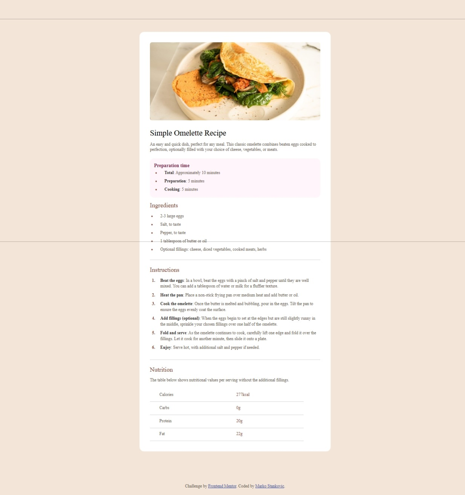

# Frontend Mentor - Recipe page solution

This is a solution to the [Recipe page challenge on Frontend Mentor](https://www.frontendmentor.io/challenges/recipe-page-KiTsR8QQKm). Frontend Mentor challenges help you improve your coding skills by building realistic projects. 

## Overview

### Screenshot

### Links

- Solution URL: [Solution](https://www.frontendmentor.io/solutions/recipe-page-9-08TJp-Eu)
- Live Site URL: [LiveSite](https://recipe-page-bay-rho.vercel.app/)

### Built with

- Semantic HTML5 markup
- CSS custom properties
- Flexbox
- CSS Grid
- Mobile-first workflow
- [React](https://reactjs.org/) - JS library
- [Next.js](https://nextjs.org/) - React framework
- [Styled Components](https://styled-components.com/) - For styles

## Author

- Frontend Mentor - [@Stankovic77](https://www.frontendmentor.io/profile/Stankovic77)
- Github - [@Stankovic77](https://github.com/Stankovic77)
- Vercel - [@Stankovic77](https://vercel.com/markos-projects)